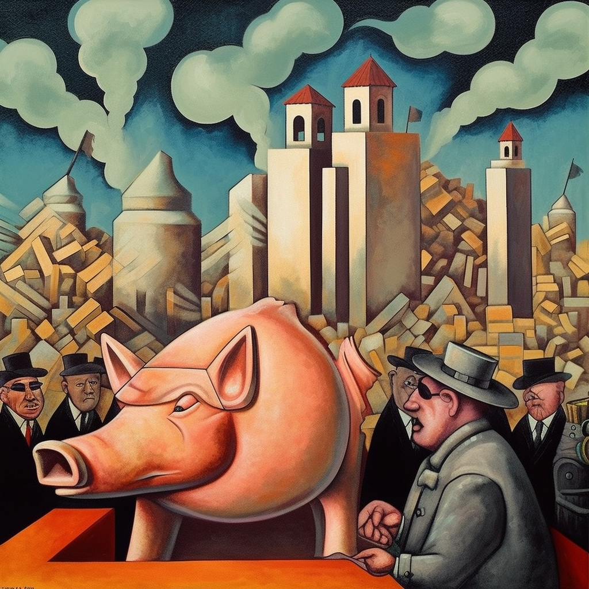

# A Contradição do Salário Mínimo: Uma Perspectiva Anarcocapitalista
Em qualquer discussão séria sobre economia, parece haver um consenso: a interferência do governo na precificação de bens e serviços é uma afronta à liberdade econômica. A mão invisível do mercado é preferível à mão pesada do estado. Entretanto, essa mesma sociedade que defende vigorosamente a não intervenção nos preços dos bens e serviços, paradoxalmente, tolera e até aplaude a implementação de um salário mínimo. Por que essa discrepância?

## O Preço do Trabalho
A imposição de um salário mínimo é, em sua essência, uma forma de controle de preços, onde o 'bem' em questão é o trabalho humano. Entretanto, essa forma de controle de preços é aceita e até defendida por muitos. A justificativa? A proteção dos trabalhadores contra a exploração e a garantia de uma remuneração justa pelo seu trabalho. Mas essa lógica é realmente sólida?

## A História do Salário Mínimo: Um Conto de Boas Intenções
O conceito de salário mínimo foi introduzido pela primeira vez na Nova Zelândia em 1894 e logo se espalhou para outros países como uma forma de garantir um "salário de subsistência" para os trabalhadores. Na superfície, essa parece uma causa nobre, mas a realidade é que, assim como qualquer outra forma de controle de preços, o salário mínimo tem consequências não intencionais.

## As Consequências Não Intencionais: Desemprego e Informalidade
A imposição de um salário mínimo cria distorções no mercado de trabalho. Ao estabelecer um 'preço mínimo' para o trabalho, o governo efetivamente exclui do mercado aqueles cujas habilidades ou experiência não justificam esse salário mínimo. Isso cria uma barreira à entrada no mercado de trabalho para os menos qualificados ou inexperientes. Além disso, empresas que operam com margens de lucro reduzidas podem ser incapazes de pagar o salário mínimo obrigatório e, como resultado, podem contratar menos trabalhadores ou mover suas operações para a economia informal.

## A Restrição à Liberdade: Uma Perspectiva Anarcocapitalista
Para um anarcocapitalista como eu, qualquer forma de controle de preços, incluindo o salário mínimo, é uma restrição à liberdade individual. Ele impede os indivíduos de venderem sua força de trabalho pelo preço que consideram justo e impede os empregadores de contratar com base no valor que acreditam que o trabalho vale. Ao invés de proteger os trabalhadores, o salário mínimo pode, paradoxalmente, prejudicá-los, restringindo suas oportunidades e liberdade de escolha.

## Conclusão: Reconsiderando o Salário Mínimo
A questão do salário mínimo é mais complexa do que parece à primeira vista. Enquanto a intenção por trás da sua implementação é nobre, as consequências não intencionais podem ser prejudiciais, especialmente para os mais vulneráveis na sociedade. Talvez seja hora de reconsiderar o papel do governo no mercado de trabalho e explorar alternativas que permitam maior liberdade e

