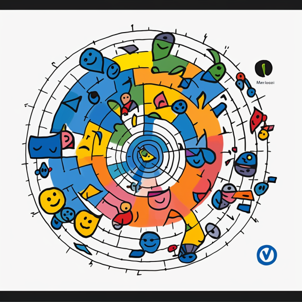

# Revolução Organizacional: 

*As Organizações Autônomas Descentralizadas*

*Por Govinda Systems*

A humanidade sempre teve uma relação fascinante com a inovação tecnológica. Desde a invenção da roda até a chegada da Internet, cada nova tecnologia moldou a forma como vivemos, trabalhamos e interagimos uns com os outros. Hoje, estamos testemunhando outra revolução tecnológica em andamento: a ascensão das Organizações Autônomas Descentralizadas (DAOs).

As DAOs são estruturas organizacionais baseadas em blockchain que permitem a tomada de decisões de forma coletiva e descentralizada. Estamos vendo uma grande variedade de DAOs surgindo, cada uma com sua própria estrutura de governança, objetivos e projetos que buscam apoiar. Elas são como navios na vasta oceanos da economia digital, cada uma com seu próprio curso e tripulação.

## Os Tipos de DAOs

Dentro dessa nova onda de inovação, encontramos diferentes tipos de DAOs, cada um com seu próprio propósito e mecanismos de governança.

### DAOs de Governança

Elas permitem que os detentores de tokens tomem decisões sobre um projeto ou protocolo específico. O poder de voto é geralmente proporcional à quantidade de tokens que um indivíduo possui. A MakerDAO é um exemplo famoso, permitindo aos detentores de tokens tomar decisões cruciais sobre a direção do projeto.

### DAOs de Serviço

Essas DAOs fornecem um serviço específico para seus usuários, como um protocolo de empréstimo descentralizado. Os detentores de tokens podem votar em decisões que afetam o funcionamento do serviço.

### DAOs de Caridade

Estas são criadas com o propósito de levantar fundos para causas específicas. Os detentores de tokens podem votar para decidir quais projetos de caridade receberão financiamento.

### DAOs de Investimento

Também conhecidas como Venture DAOs, elas são criadas para investir coletivamente em outros projetos. Os membros da DAO contribuem com fundos, que são então alocados para investimentos com base em votações.

### DAOs de Trabalho ou Cooperativas

Essas DAOs são formadas por grupos de indivíduos que desejam trabalhar juntos para um objetivo comum. Os membros podem ser recompensados com tokens por contribuir com seu tempo e esforço para a organização.

### DAOs de Protocolo

Essas DAOs são criadas para gerenciar e desenvolver um protocolo blockchain. Elas geralmente têm um token associado que é usado para incentivar a participação na rede e votar em propostas de governança.

## Adaptação e Inovação

Ao longo da história, a humanidade sempre teve que se adaptar à chegada de novas tecnologias que aumentaram a eficiência e a produção. A Revolução Industrial do século XIX, por exemplo, transformou radicalmente a sociedade e a economia da época, trazendo consigo uma era de crescimento e prosperidade sem precedentes.

Atualmente, estamos vivendo duas revoluções tecnológicas significativas: a ascensão das

