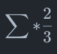

# [Agil] - Dinâmica_Agentes_Racionais

## Resumo

Como talvez nos estamos condifionados e ter um pensamento orientado a algo não Racional.

#Jogo do Ganha Todos#

Dinâmica para mostrar para o time que é bem melhor quanto todos Ganham.

## Responsa %%%%%%%%%%%%%%%%

## Regras

- 1 - Escolha um numero de [0, ..., 100]

## Ganhador

- Quem escolheu o menor número mais próximo que a Somatória de todos os palpites, vezes 2/3 (dois terços)

Como ler a função matemática acima: Suja a somatória , vezes dois terços.

## Palpites 

* Camila    (idade: 06 anos): 0
* Gustavo   (idade: 12 anos): 50
* Charmander(idade: 01 ano ): 25
* Bud     (idade: 07 anos): 10
* Andrea  (idade: 25 anos): 70
* Govinda (idade: 32 anos): 28
* Steve   (idade: 03 anos): 40
* .
* .
* .
* Total somatória : 228 

## Ganhador 

* Camila

## Qual número todos os participantes poderiam escolher, onde todos iriam ganhar ?

* 0

* > qualquer número vezes 0 será igual a Zero.

## Por quê ZERO ?

* Zero multiplicando com qualquer número é sempre ZERO.

Então :

* Se todos escolherem o ZERO todos venceriam.

> ## Eu não falei que teria que ser apenas um ganhador

## Provocação

Você toma suas decições Racionalmente, ou apenas o faz pela força do hábito ?

## Então pq a decisão mais óbvia não é Zero ?

 * ??

 * ??

## Será que você tomou essa decisão de forma consciente ou foi apenas um hábito ?

## Link

Conversa Rápida - Agentes Racionais - Raphael Molesim : https://youtu.be/vQX9vpb46do

O poder do hábito : https://www.youtube.com/watch?v=9BtrLf6PfYY

Funções no git : https://ajustetecnico.github.io/blog/2018/09/19/equacoes-latex/

## My Profile Resume

| [ Govinda](https://github.com/govinda777) |
| :---: |

