# [--Agil--]

> ### OKR como implementar de maneira simples no jira ?

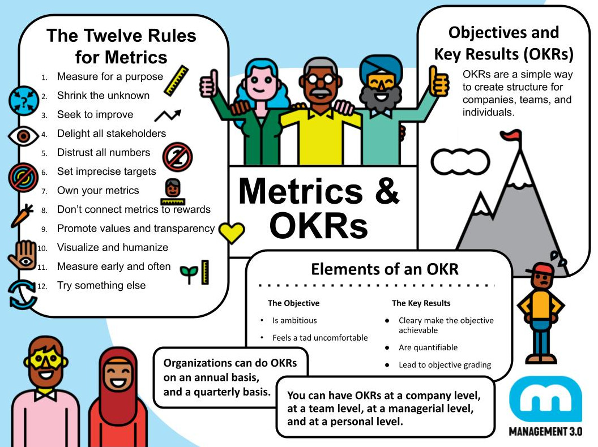

## Principal meta

* KPI TIME ##

Meta do time :

Lead_time_in_avg : true 

Para 60% das Histórias.

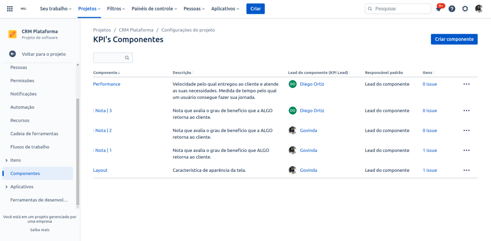

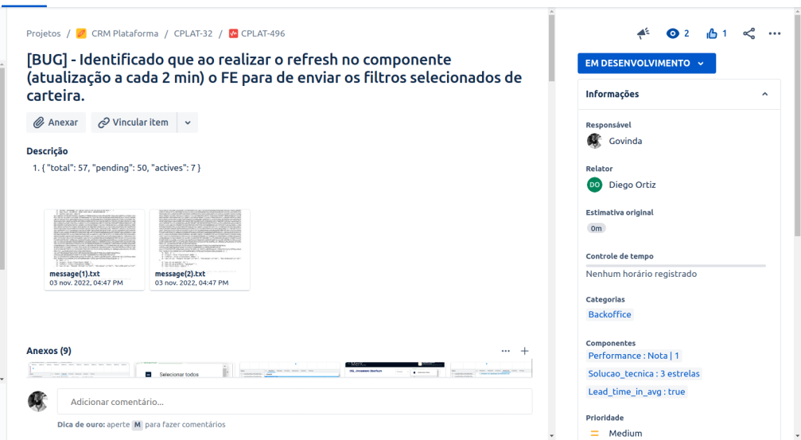

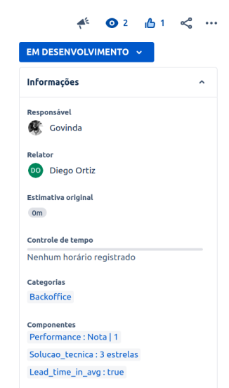

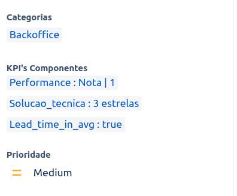

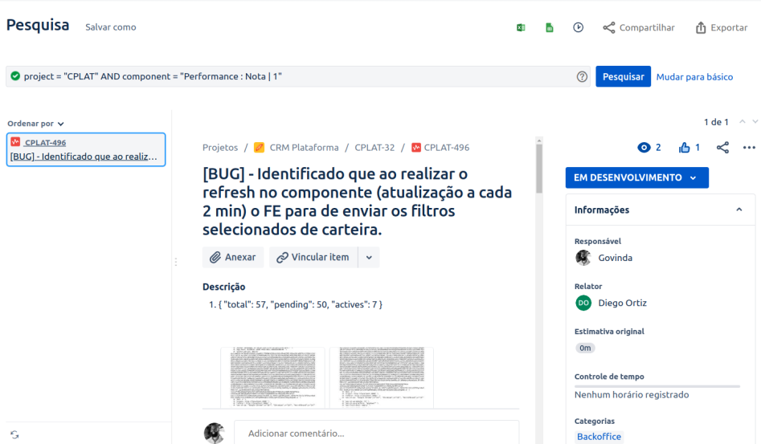

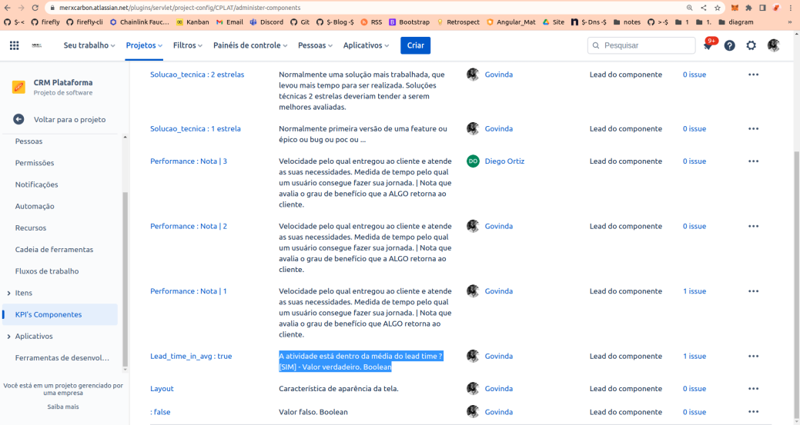

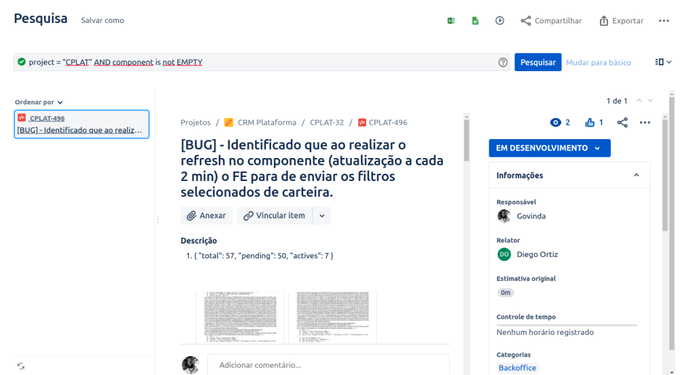

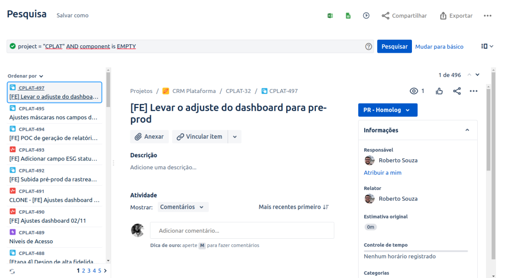

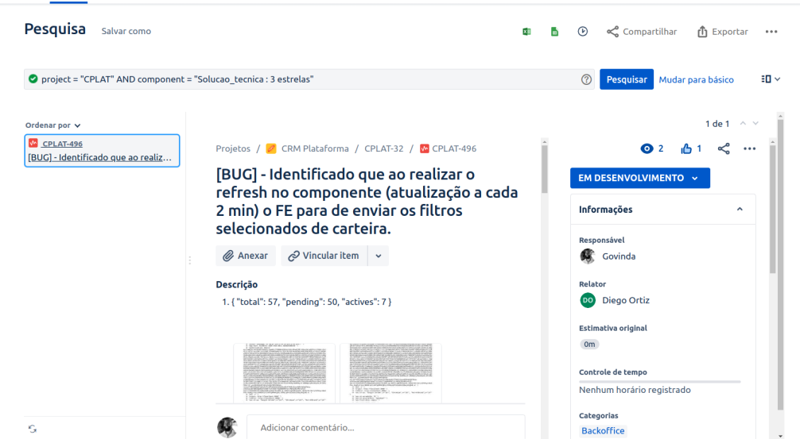

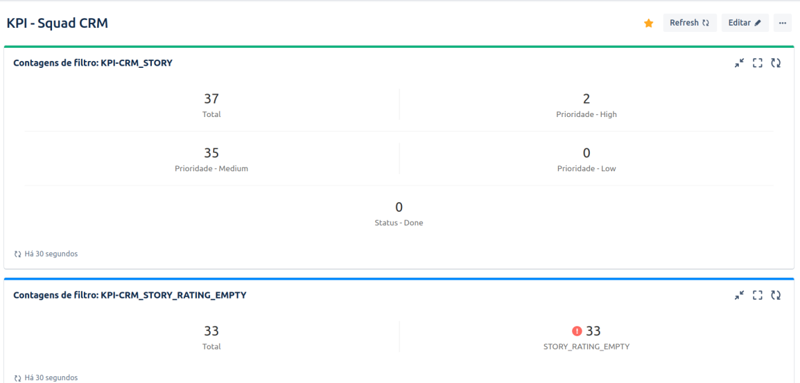

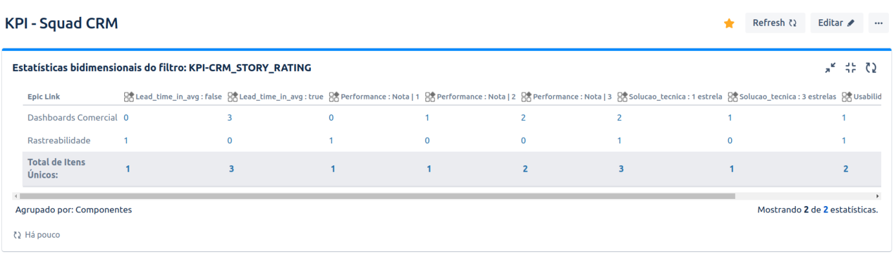

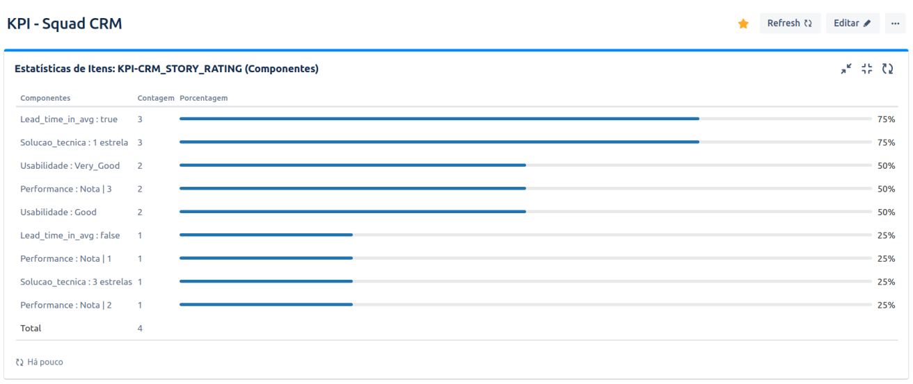

## References : 

Book : Smart Leaders, Smarter Teams: How You and Your Team Get Unstuck to Get Results (English Edition): https://www.amazon.com.br/dp/B00BMU3IC4/ref=dp-kindle-redirect?_encoding=UTF8&btkr=1

Course : Develop decision-making, learning and decision-making skills : https://k21.global/br/treinamentos/tecnicas-ageis-facilitacao?cupom=GOVIN

