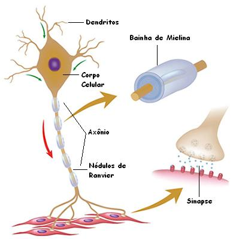

# EM construção

# [--Blockchain--]

> ### A anatomia de uma rede neural Corelacionado com a anatomia de uma rede Blockchain

## Como funciona a transferencia de informação de um neuronio para outro

Pulsos elétricos

Dentro dos neuronios temos :

* Sinapse (transmição de uma informação de um neuronio para outro)

* Lembrança (Dados como imagens / odores / momentos / cariocinios)

* Sentimentos (pulsos quimicos que dão uma sensação de bem estar ou mal estar)

## 

## Como a Blockchain tenta imitar uma Rede neoral Cerebral

> ### co relação anatomica de uma Blockchain com um neuronio 

##select é gratis CREATE é pago Qual é a co relação do CREATE  com as lembranças e sinapces  -- : a taxa é o custo pelo qual o organismo tem para fazer algo . --

TAXA (TX) 

$= TX =$

##TX é o custo pelo qual a blockchain tem para realizar a gravação dos dados...

## qual é a similaridade da democracia com a estrutura the bra  , e a estrutura do banco de dados da blockchain....

---------------------

Anatomia do corpo

-----------------------

# Corpo Humano
## Celula
### neuronio
#### Sinapse
#### Lembrança
#### Sentimentos
#### Estádo físico da celula

---------------------

Anatomia da Block chain

-----------------------

# Network
## Node
### Versão do Node (programa Blockchain | Sistemas baseados na transparencia e )
### Banco de dados
#### Validadores
####
#### Transações
##### Token > Dá pra dividir (Carteira)
##### NFT  > Não dá pra dividir (Carteira)

--------------------------------------------------------------------

---------------------

Anatomia do corpo _ X _ Anatomia da Block chain

-----------------------

# Corpo Humano (Network)
## Celula (Node)
### neuronio (Banco de dados | Validadores)
#### Sinapse (Transações)
#### Lembrança (Token | NFT)
#### Sentimentos  (Token | NFT)
#### Estado corporal (NFT)

---------------------

O que estamos fazendo ?

Corelacionando o 

> Anatomida do Corpo Humano
   > Agentes

> Anatomia da Blockchain
   > Agentes

>  Capasidade de uma comunidade criar um Governo, PQ , Capasidade de uma pessoa criar um sistema Transparente Monetário .... $$$$$$$$$$$$$$$$$$$$$$$$$$$$$$$$$$$$$$$$$$$$$$$$$$$$$$$$$$$$$$$$$$$$$

##
