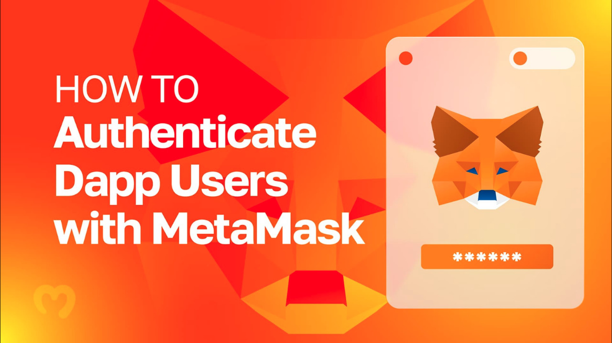
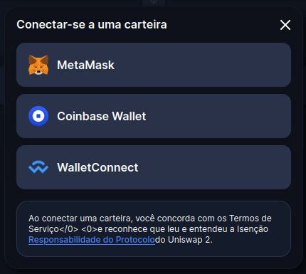
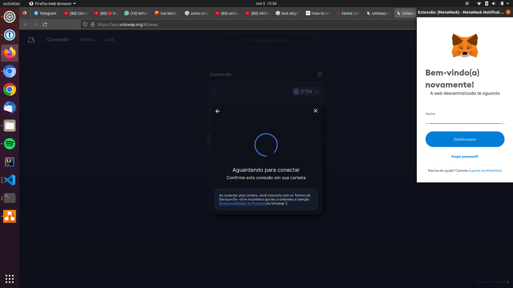
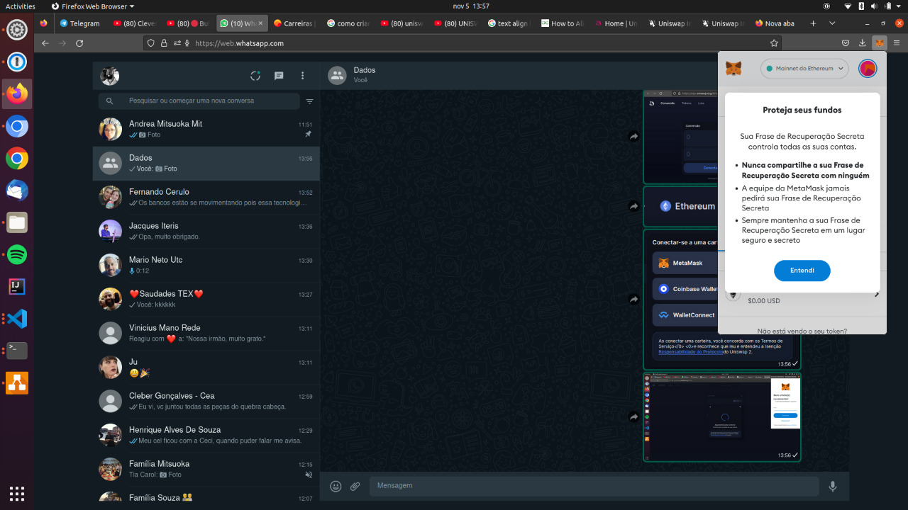
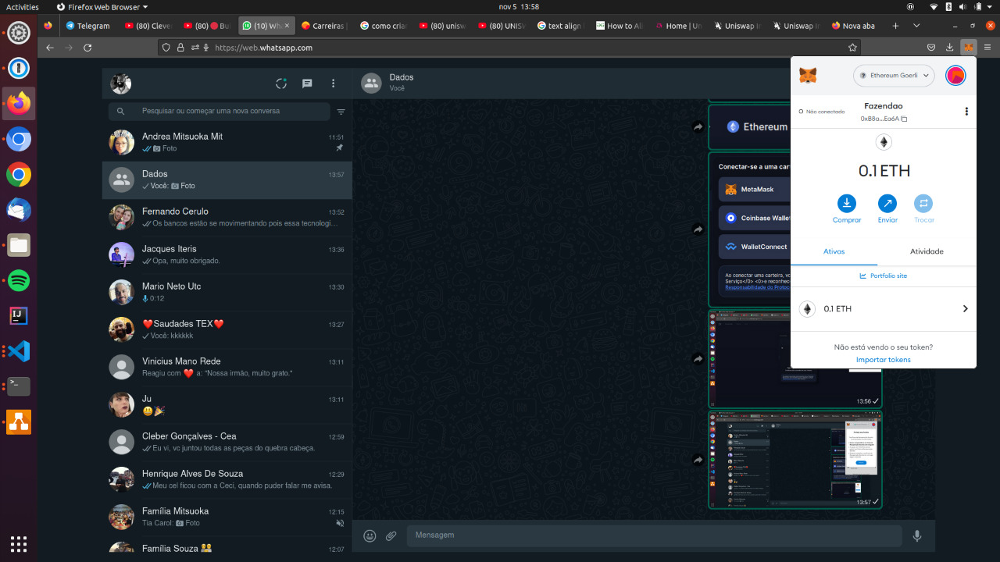
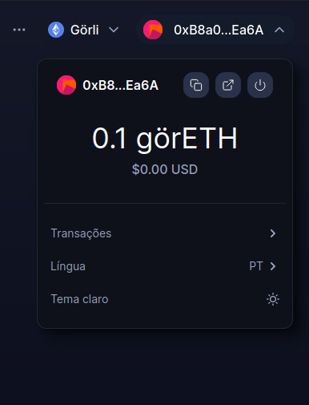
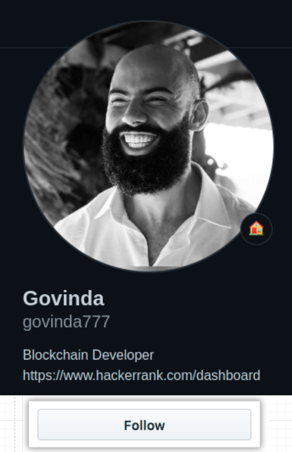

# [--Blockchain--]

> ### Como realizar uma autenticacao utilizando sua Carteira (hot wallet) ?



## O que você vai precisar ?

Uma carteira na MetaMesk.

| [<br><h3 style="text-align: left;">COMO CRIAR CARTEIRA METAMASK ATUALIZADO 2021 (TUTORIAL COMPLETO)</h3>](https://www.youtube.com/watch?v=SDYBxKlqIhw) |
| :---: |

## Passo 1

Após configurar a sua carteira MetaMask, entre no site:

* https://uniswap.org/

<details>
  <summary>[+]</summary>

| [<br><h3 style="text-align: left;">UNISWAP EXPLICADA</h3>](https://www.youtube.com/watch?v=7tQdgxRJXsg) |
| :---: |


</details>

## Passo 2 (Autenticação)














Endereço da carteira na etherscan: https://goerli.etherscan.io/address/0xB8a0c3e8f4f5F1325d878A10591cE3562009Ea6A

| [<br><p style="text-align: left">Entendendo o seu Comportamento - Raphael Molesim</p>](https://www.youtube.com/watch?v=x3eRXeMB-4k&t=36s) |
| :---: |
```python

help.msg(title="[Documentação|Links]", message="""

https://www.youtube.com/watch?v=x3eRXeMB-4k&t=36s

"""
, **options)

```

* 00:46:58 - Set up Metamask Authentication with NextJS

<p align="left">

<a href="https://github.com/govinda777?tab=followers">

</a>

</p>

[](https://www.buymeacoffee.com/govinda777)

## Link

Repo exemplo DApp Web 3.0 : https://github.com/CleverProgrammers/opensea-blockchain-youtube

Investopedia: https://www.investopedia.com/

Banner Img: https://moralis.io/wp-content/uploads/2022/07/22_07_How-to-Authenticate-Dapp-Users-with-MetaMask-1.jpg

Pedras Rai e o Bitcoin : https://www.youtube.com/watch?v=Hil_N6YDG6Y

Arquitetura P2P: https://www.youtube.com/watch?v=LiOZcck8dfU

P2Ps Escrow Service Work : https://www.binance.com/en/blog/all/how-does-binance-p2ps-escrow-service-work-421499824684900825

Link plataforma: https://www.kaleido.io/

Link de video mostrando como utilizar: https://www.youtube.com/watch?v=2XzxdlqN0ks&ab_channel=Kaleido

Documentação firefly: https://github.com/hyperledger/firefly
 
AML : https://www.sec.gov/about/offices/ocie/amlsourcetool.htm

Bitcoin Escrow Script: https://www.youtube.com/watch?v=hljavgPb6Yw

What is Escrow: https://www.youtube.com/watch?v=Xt5pUmeicqo

Escrow : https://www.youtube.com/watch?v=jBIfyVFMoHc

Smart Contract : https://www.youtube.com/watch?v=ooN6kZ9vqNQ

Curso de Blockchain para Negócios: aplicações e cases reais : https://cursos.alura.com.br/course/blockchain-para-negocios

Curso de Blockchain: aumente a confiança da sua aplicação : https://cursos.alura.com.br/course/blockchain-confianca-da-sua-aplicacao

Exemplo de Incentivos errados que possibilitam a corrupção : https://www.youtube.com/watch?v=Vq1MjgGoVpQ&t=197s

Falha Bizantina : https://academy.bit2me.com/pt/que-es-falla-bizantina/