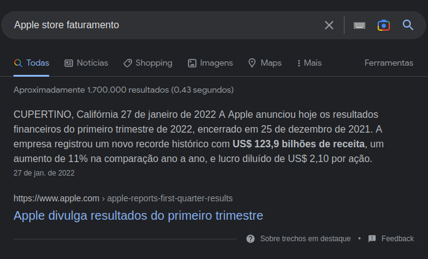
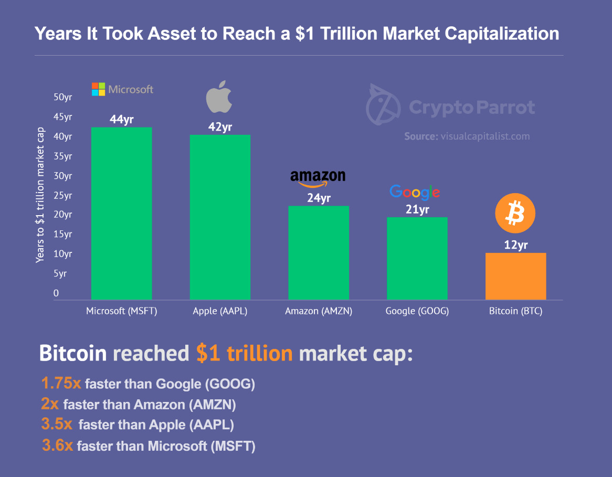

# Blockchain 
> ### ¨Qual é o impacto que essa industria esta causando no mercado de desenvolvimento de software¨

## Relembrando.

Tivemos um bumm em 2008 no mercado de APPs.

Foi uma maneira revolucionária que abriu um novo mercado de venda de Softwares / Serviços / Assinaturas / Faturamento.

Vamos focar nesse ultimo ponto * Faturamento.

## Faturamento : Google Play & App Store

Hoje Google Play, App Store são lojas com um faturamento muilt bilionário.

## Tamanho mercado cripto:

## Comparação Bitcoin vs Big Techs

## Fato.

Hoje, com as cripto moedas, é muito fácil você subir uma aplicação utilizando qualquer rede blockchain e realizar uma venda ainda no mesmo dia.

## Será que o mercado Cripto conseguirá fazer frente ao mercado de APPs ? Ou cada um tem o seu espaço garantido no mercado ?

## Tutoriais

Aqui estão alguns tutoriais que sinceramente achei incriveis.

| [ 
Build OpenSea 2.0 Web3 dApp with Next.js, Replit, thirdweb, Infura, & Tailwind CSS
](https://www.youtube.com/watch?v=LP6mRPBg_4I) |
| :---: |

| [ 
Build Uniswap 3.0 App with Infura & NextJS (Full Swap Functionality)
](https://www.youtube.com/watch?v=xR29afPvdxQ) |
| :---: |

| [ 
Build Airbnb with Solana & Next.js
](https://www.youtube.com/watch?v=HIWuUdo9utw) |
| :---: |

| [ 
Build Bored Ape Yacht Club with Next.js, Tailwind & Thirdweb (NFT Drop Tutorial)
](https://www.youtube.com/watch?v=P5jetKCsupo) |
| :---: |

## Link

Investopedia: https://www.investopedia.com/

Banner Img: https://www.investopedia.com/tech/most-important-cryptocurrencies-other-than-bitcoin/

Pedras Rai e o Bitcoin : https://www.youtube.com/watch?v=Hil_N6YDG6Y

Arquitetura P2P: https://www.youtube.com/watch?v=LiOZcck8dfU

P2Ps Escrow Service Work : https://www.binance.com/en/blog/all/how-does-binance-p2ps-escrow-service-work-421499824684900825

Link plataforma: https://www.kaleido.io/

Link de video mostrando como utilizar: https://www.youtube.com/watch?v=2XzxdlqN0ks&ab_channel=Kaleido

Documentação firefly: https://github.com/hyperledger/firefly
 
AML : https://www.sec.gov/about/offices/ocie/amlsourcetool.htm

Bitcoin Escrow Script: https://www.youtube.com/watch?v=hljavgPb6Yw

What is Escrow: https://www.youtube.com/watch?v=Xt5pUmeicqo

Escrow : https://www.youtube.com/watch?v=jBIfyVFMoHc

Smart Contract : https://www.youtube.com/watch?v=ooN6kZ9vqNQ

Curso de Blockchain para Negócios: aplicações e cases reais : https://cursos.alura.com.br/course/blockchain-para-negocios

Curso de Blockchain: aumente a confiança da sua aplicação : https://cursos.alura.com.br/course/blockchain-confianca-da-sua-aplicacao

Exemplo de Incentivos errados que possibilitam a corrupção : https://www.youtube.com/watch?v=Vq1MjgGoVpQ&t=197s

Falha Bizantina : https://academy.bit2me.com/pt/que-es-falla-bizantina/