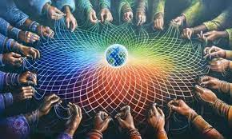
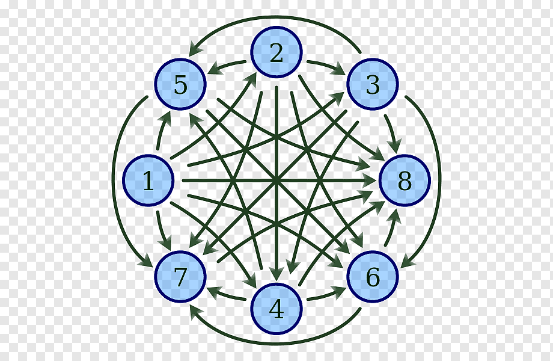
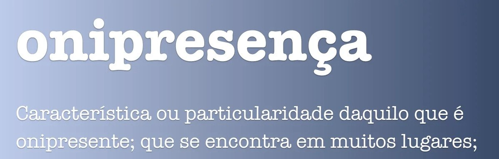

# [--Blockchain--]

> ### Rede Blockchain / Rede Budista / Teia de Indra

## Teia de Indra

## Átma

Átma, ou Atman, é o termo usado no hinduísmo para alma (espírito, ou consciência) e princípio de vida (sopro). A alma individual é semelhante à alma universal (Brama). No hinduísmo também significa aquilo que é imutável, indivisível e eterno, a verdadeira natureza das coisas.
O conceito geralmente usado de "Eu Superior", "Ser Espiritual", que está para além do corpo e da mente, aproxima-se ao de Átma.

Como falamos no artigo [Blockchain__A_anatomia_de_uma_rede_neural__corelacionado_com_uma_rede_Blockchain.md](Blockchain__A_anatomia_de_uma_rede_neural__corelacionado_com_uma_rede_Blockchain.md)
os dados de uma Blockchain, são armazenados em cada nó da rede.

Na imagem acima, cada numero representa um Nó (node) 

Ou seja, cada nó possui todos os dados já armazenados, na Blockchain. 

Fato interessante desses dados, é que eles são armazenados de uma forma com que não podem ser mudados ou corronpidos. Isso apenas é possivel através por causa da criptografia e estrutura

## Onipresente

## Onipresença Divina 

## Onipresença dos Dados

> ### como a Blockchain tenta imitar uma Rede neoral Cerebral

> ### co relação anatomica de uma Blockchain com um neuronio 

##select é gratis CREATE é pago Qual é a co relação do CREATE  com as lembranças e sinapces  -- : a taxa é o custo pelo qual o organismo tem para fazer algo . --

TAXA (TX) 

$= TX =$

##TX é o custo pelo qual a blockchain tem para realizar a gravação dos dados...

## qual é a similaridade da democracia com a estrutura the bra  , e a estrutura do banco de dados da blockchain....

---------------------

Anatomia do corpo

-----------------------

# Corpo Humano
## Celula
### neuronio
#### Sinapse
#### Lembrança
#### Sentimentos
#### Estado corporal

---------------------

Anatomia da Block chain

-----------------------

# Network
## Node
### Versão do Node (programa Blockchain | Sistemas baseados na transparencia e )
### Banco de dados
#### Validadores
####
#### Transações
##### Token > Dá pra dividir (Carteira)
##### NFT  > Não dá pra dividir (Carteira)

--------------------------------------------------------------------

---------------------

Anatomia do corpo _ X _ Anatomia da Block chain

-----------------------

# Corpo Humano (Network)
## Celula (Node)
### neuronio (Banco de dados | Validadores)
#### Sinapse (Transações)
#### Lembrança (Token | NFT)
#### Sentimentos  (Token | NFT)
#### Estado corporal (NFT)

---------------------

O que estamos fazendo ?

Corelacionando o 

> Anatomida do Corpo Humano
   > Agentes

> Anatomia da Blockchain
   > Agentes

>  Capasidade de uma comunidade criar um Governo, PQ , Capasidade de uma pessoa criar um sistema Transparente Monetário .... $$$$$$$$$$$$$$$$$$$$$$$$$$$$$$$$$$$$$$$$$$$$$$$$$$$$$$$$$$$$$$$$$$$$$

##
