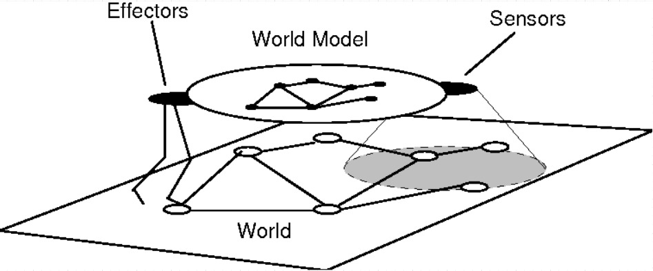
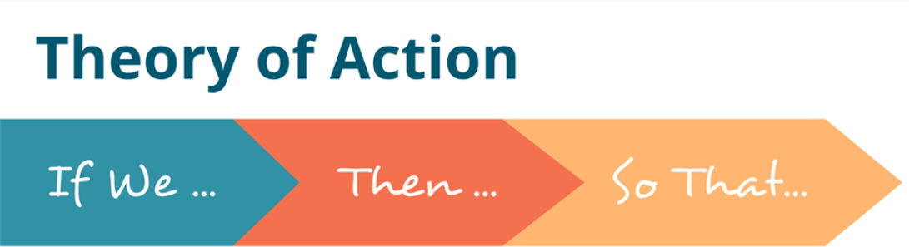
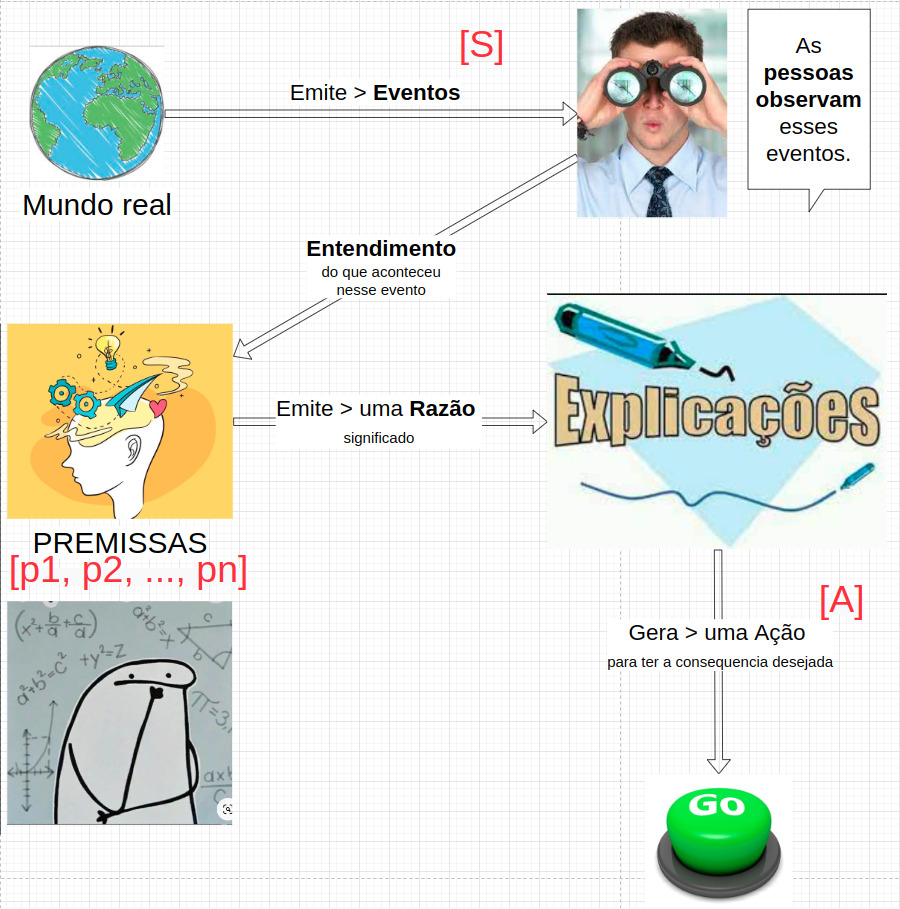
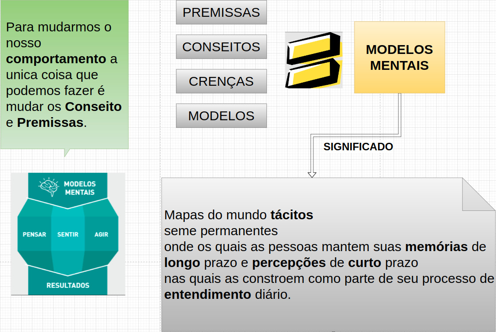
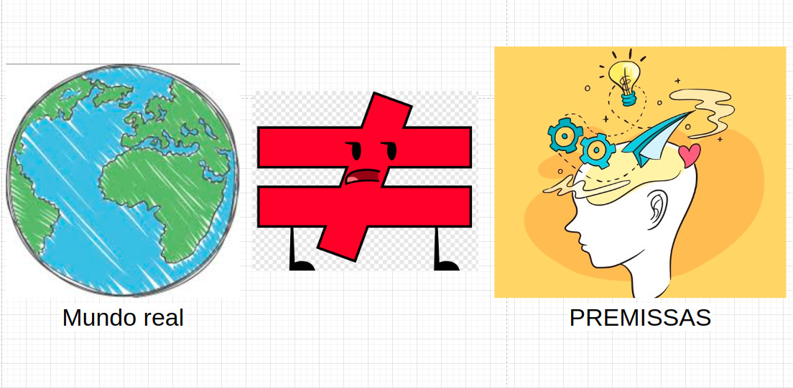
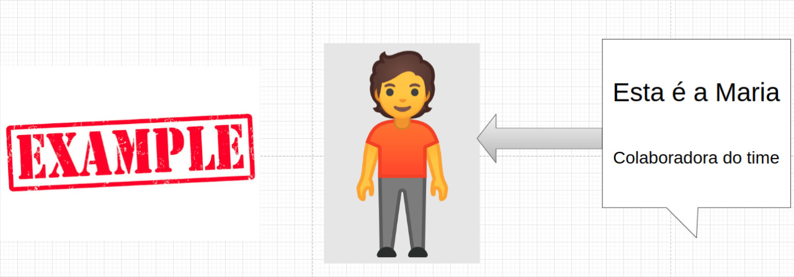

# [Agil > Técnicas de Facilitação] - Entendendo o seu Comportamento


## Theories of Action



```cmd

```




## Significado

Se eu estou na situação <span style="color:red">[S]</span> e eu quero criar uma consequência <span style="color:red">[C]</span>, dado as premissas <span style="color:red">[p1, p2, ..., pn]</span>, então eu devo fazer <span style="color:red">[A]</span> .


## [Explicando] : Theories of Action



### [Explicação]

No diagrama a cima.

Poucas coisas estão sobre nosso controle.

Não conseguimos fazer com que o Mundo real pare de emitir eventos.

Assim como não conseguimos parar de observar esses evendos e construir um entendimento a partir das nossas premissas ou modelos mentais. 

Muito menos, conseguimos parar de agir a partir das explicações e razões obtidas.





## Nem sempre as nossas <b>Premissas</b> são um <b>espelho</b> do <b>Mundo real</b>







## Unilateral Control Approach (Modelo de Controle Unilateral)


<details>
  <summary>Glossário</summary>


</details>

## <$- HashTags -$>

#kanban #agil #scrum #mindset #mutual_learning_mindset #unilateral_control_mindset

## References

* A teoria de Argyris e Schön sobre
congruência e aprendizagem : http://www.aral.com.au/resources/argyris.html

* Book : Smart Leaders, Smarter Teams: How You and Your Team Get Unstuck to Get Results (English Edition): https://www.amazon.com.br/dp/B00BMU3IC4/ref=dp-kindle-redirect?_encoding=UTF8&btkr=1


* [Técnicas de facilitação] - Desenvolva habilidades de facilitar interações. : https://k21.global/br/treinamentos/tecnicas-ageis-facilitacao?cupom=GOVIN


## My Profile Resume

| [<br><sub>Govinda</sub>](https://github.com/govinda777) |
| :---: |


<p align="left">

<a href="https://github.com/govinda777?tab=followers">

</a>

</p>

[](https://www.buymeacoffee.com/govinda777)

