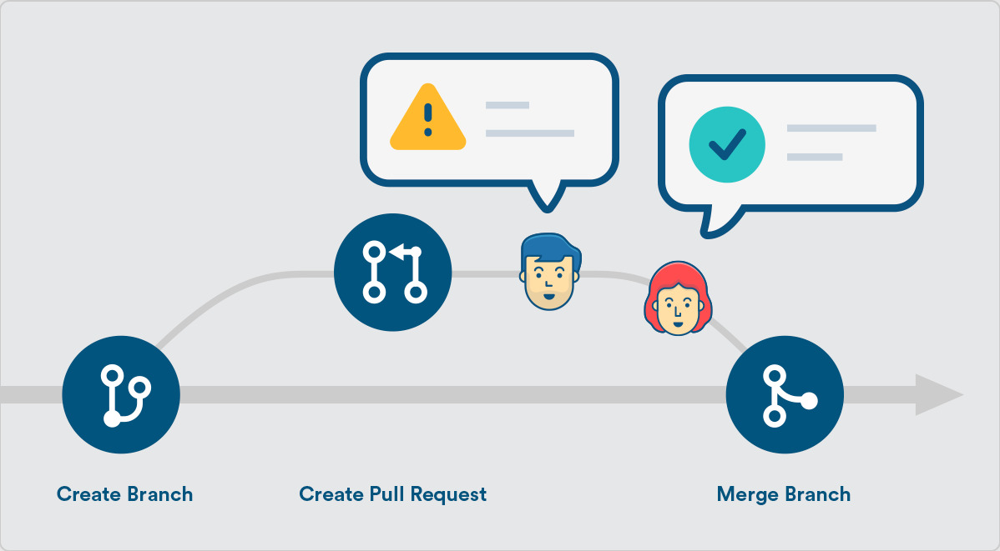
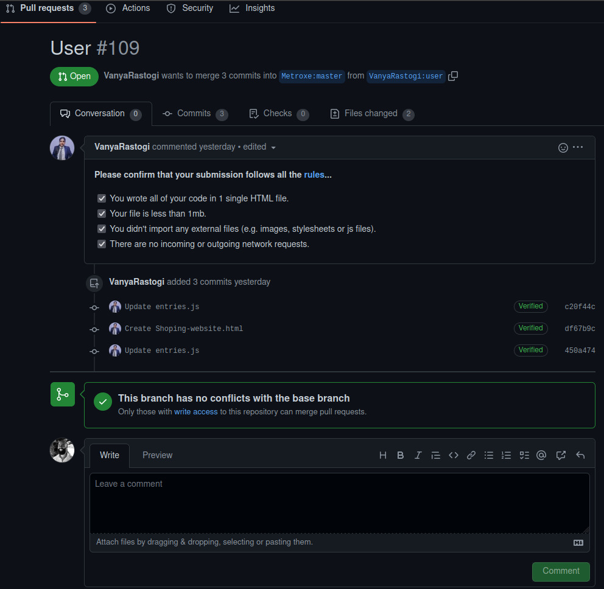
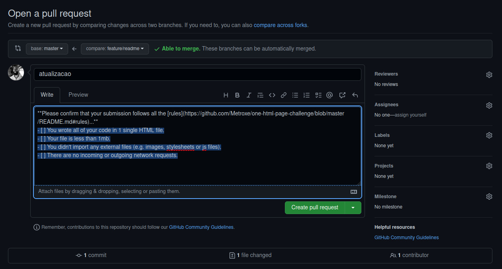
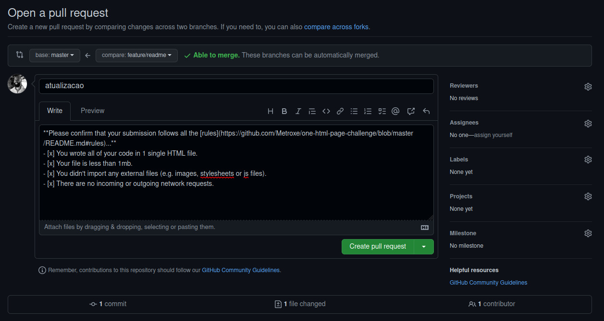
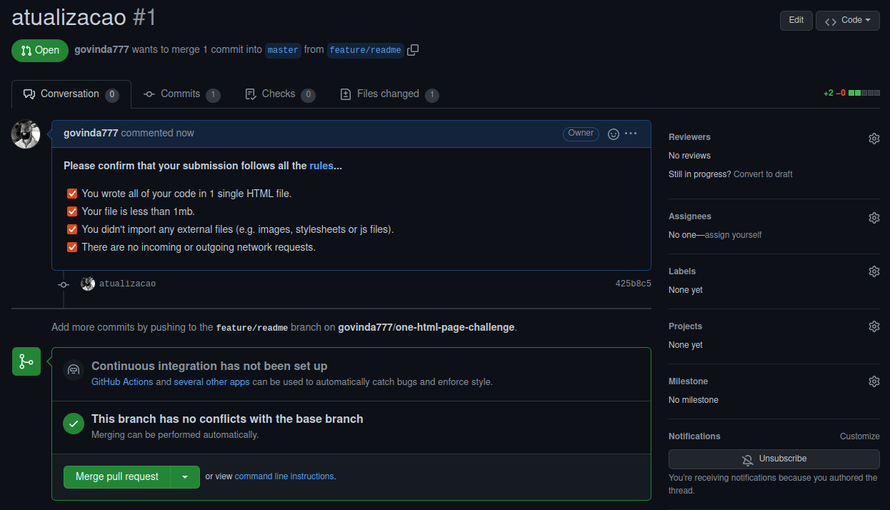
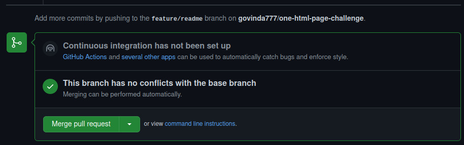

# Como Criar pull request template no Github



## Como implementar ?

> Dentro da sua pasta .github, crie o arquivo ´pull_request_template.md´


```cmd

cd .github

pull_request_template.md

```

## Exemplo de arquivo (pull_request_template.md)


```cmd

**Please confirm that your submission follows all the [rules](https://github.com/Metroxe/one-html-page-challenge/blob/master/README.md#rules)...**

- [ ] You wrote all of your code in 1 single HTML file.
- [ ] Your file is less than 1mb.
- [ ] You didn't import any external files (e.g. images, stylesheets or js files).
- [ ] There are no incoming or outgoing network requests.

```

## Veja funcionando












## Ref

* Repositório : https://github.com/Metroxe/one-html-page-challenge/blob/master/.github/pull_request_template.md

## Links

* Creating a pull request template for your repository : https://docs.github.com/en/communities/using-templates-to-encourage-useful-issues-and-pull-requests/creating-a-pull-request-template-for-your-repository

* Common validation errors when creating issue forms : https://docs.github.com/en/communities/using-templates-to-encourage-useful-issues-and-pull-requests/common-validation-errors-when-creating-issue-forms

## My Profile Resume

| [<br><sub>Govinda</sub>](https://github.com/govinda777) |
| :---: |

## <$- HashTags -$>

#kanban #agil #scrum #mindset #mutual_learning_mindset #unilateral_control_mindset


## Subscribe

| [<br><sub>Luã Govinda</sub>](https://github.com/govinda777/blog/[WIP]_-_[--Agil__Entendendo_Seu_Comportamento--]__O_que_eh__Unilateral_Control_Mindset.md) |
| :---: |


| [<br><sub>Subscribe_ME</sub>](https://github.com/govinda777?tab=followers) |
| :---: |

<p align="left">

<a href="https://github.com/govinda777?tab=followers">

</a>

</p>

## Buy-me-a-coffe

<p style="magin-top:100px" align="left">

<a href="https://github.com/govinda777/buy-me-a-coffe">


</a>

<$- Buy-me-a-coffe -$>

</p>

# Links

* Outro exemplio de implementação : https://github.com/govinda777/blog/blob/main/README-Components.md#mapas-geofraficos-mapas-do-geojson-e-topojson

* Documentação README.md Markdown : https://docs.github.com/pt/get-started/writing-on-github/getting-started-with-writing-and-formatting-on-github/basic-writing-and-formatting-syntax

* Outra documentação sobre Markdown : https://docs.pipz.com/central-de-ajuda/learning-center/guia-basico-de-markdown#open

* Documentação Discord Markdown : https://www.markdownguide.org/tools/discord/
