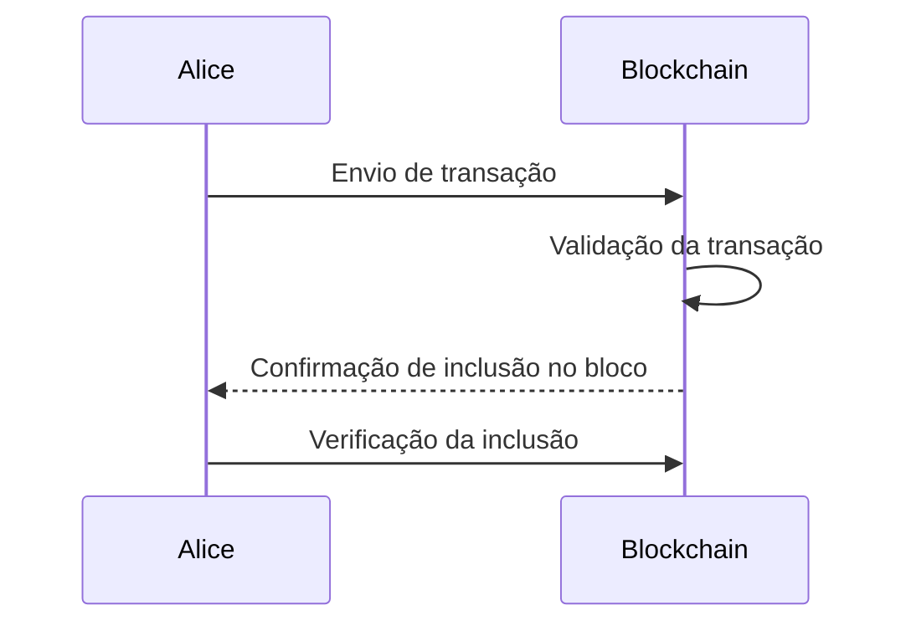
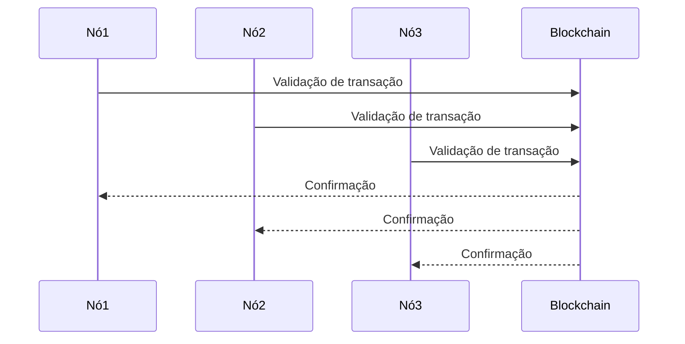

# [-TI-] O Teorema CAP e sua relação com a Blockchain

Você já ouviu falar do Teorema CAP? Não, não é um teorema sobre chapéus ou sobre como equilibrar uma caneta na ponta do nariz. O Teorema CAP é uma ideia fundamental em sistemas distribuídos e tem uma relação interessante com a tecnologia blockchain. Vamos explorar esse assunto de forma descontraída e didática, entendendo como esses conceitos se entrelaçam.

## O que é o Teorema CAP?

Antes de mergulharmos na Blockchain, vamos entender o básico do Teorema CAP. Essa teoria, também conhecida como o Teorema de Brewer, foi proposta pelo brilhante Eric Brewer em 2000. Basicamente, o Teorema CAP estabelece que é impossível garantir simultaneamente as três propriedades: Consistência, Disponibilidade e Tolerância a Partições.

- Consistência: todos os nós do sistema devem sempre ver os mesmos dados ao mesmo tempo.
- Disponibilidade: o sistema deve estar sempre disponível e respondendo a solicitações.
- Tolerância a Partições: o sistema deve continuar operando mesmo em caso de partições de rede.

## O lado divertido da Blockchain

Agora que entendemos o Teorema CAP, vamos explorar a relação com a Blockchain de uma maneira mais descontraída. A Blockchain é um livro-razão digital descentralizado, que registra transações de forma transparente e segura. Mas como isso se relaciona com o Teorema CAP? Vamos descobrir!

### Consistência e Integridade

Na Blockchain, a consistência é fundamental. Cada bloco de transações é conectado ao bloco anterior, formando uma corrente imutável. Isso garante a integridade dos dados, pois qualquer tentativa de alterar um bloco antigo exigiria a modificação de todos os blocos subsequentes. Imagine tentar reescrever a história! Seria como voltar no tempo para mudar algo que já aconteceu. Impossível, né?

### Disponibilidade e Redes Peer-to-Peer

Quando falamos de disponibilidade, a Blockchain brilha! A tecnologia Blockchain permite que os nós da rede sejam independentes e autônomos, eliminando a necessidade de um ponto central de falha. Isso significa que, mesmo que alguns nós saiam da rede, outros continuarão a processar e validar transações. É como um jogo de dominó, se um cai, os outros permanecem de pé.

### Tolerância a Partições e Descentralização

A tolerância a partições é uma habilidade fundamental da Blockchain. Ela permite que a rede continue funcionando mesmo quando ocorrem problemas de conectividade ou divisões na rede. Se uma parte da rede fica indisponível, as outras partes continuam a operar e validar transações. É como ter vários grupos de amigos que podem se comunicar entre si, mesmo quando não estão todos juntos.

## Autores e Conceitos em Sistemas Distribuídos

Em sistemas distribuídos, há uma série de autores e conceitos importantes que moldaram essa área fascinante. Aqui estão alguns deles:

- Leslie Lamport: conhecido por seus trabalhos em algoritmos de consenso e relógios lógicos, Lamport é uma referência na área de sistemas distribuídos.
- Fale com seu orientador acadêmico para obter mais informações sobre autores e conceitos relevantes para sua pesquisa.

## Conclusão

O Teorema CAP e a tecnologia Blockchain são dois tópicos empolgantes em sistemas distribuídos. Enquanto o Teorema CAP nos lembra das escolhas necessárias entre consistência, disponibilidade e tolerância a partições, a Blockchain demonstra como é possível alcançar um equilíbrio entre essas propriedades. Com suas características de consistência, disponibilidade e tolerância a partições, a Blockchain revoluciona setores e abre caminho para novas possibilidades.

Agora você está pronto para enfrentar uma conversa sobre o Teorema CAP e a Blockchain com confiança! Divirta-se explorando esses conceitos e continue aprendendo sobre sistemas distribuídos. E lembre-se, não se esqueça de fazer um backup da sua blockchain de LEGO favorita!

[Referências](#referencias)

## Referências

1. Brewer, E. (2000). Towards robust distributed systems. In Proceedings of the nineteenth annual ACM symposium on Principles of distributed computing (pp. 7-10).
2. Nakamoto, S. (2008). Bitcoin: A peer-to-peer electronic cash system. Retrieved from https://bitcoin.org/bitcoin.pdf

