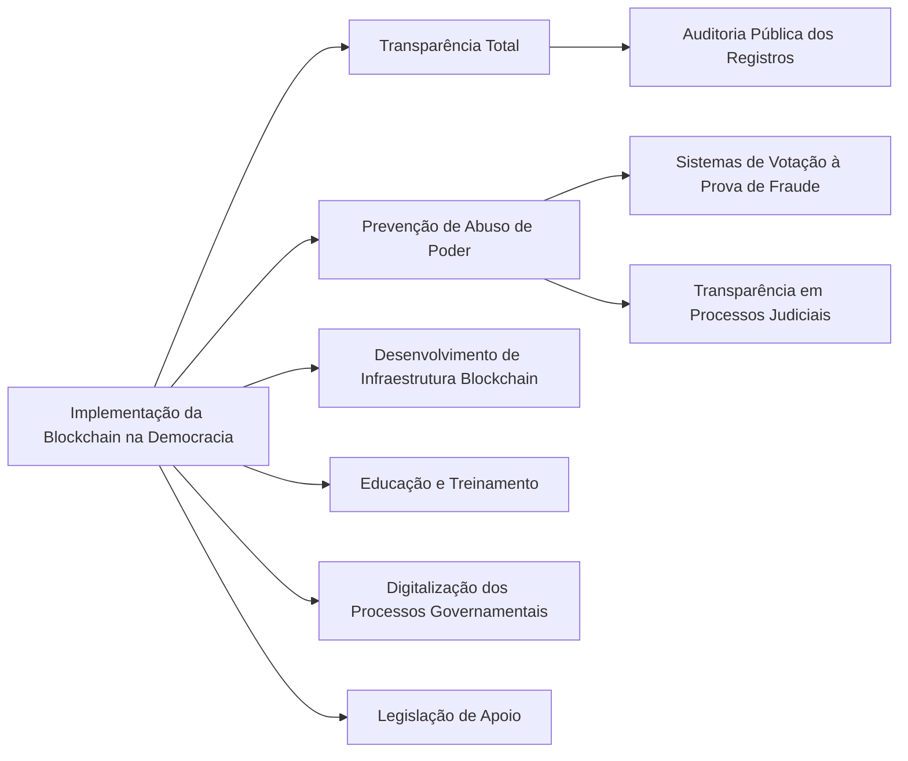

eu posso não concordar com uma palavra que você fala, mas vou defender até o fim da minha vida o seu direito de fala-la.

> Batman

**Blockchain, a única solução para a democracia**

---

A democracia contemporânea enfrenta desafios complexos, incluindo corrupção e violações de processos legais. Uma solução inovadora para esses problemas é a tecnologia blockchain, conhecida por sua transparência e segurança. Este artigo explora como a blockchain pode revitalizar a democracia, oferecendo maior transparência e impedindo o abuso de poder por figuras públicas como juízes.

### Transparência Total com Blockchain

A blockchain registra transações de forma transparente e imutável. Em um estado democrático, isso significa que todas as decisões governamentais, gastos públicos, e contratos podem ser registrados na blockchain, garantindo total transparência e responsabilidade. Cidadãos e entidades reguladoras poderiam auditar esses registros a qualquer momento, tornando quase impossível a corrupção ou manipulação de processos.

### Blockchain Contra Abuso de Poder

Uma aplicação chave da blockchain é na criação de sistemas de votação transparentes e à prova de fraudes. Isso não só garante a integridade das eleições, mas também pode ser utilizado em processos judiciais. Por exemplo, em um caso controverso, onde um juiz possa ser acusado de censura ou abuso de poder, o processo legal poderia ser conduzido e registrado na blockchain, garantindo uma transparência total e evitando a influência indevida.

### Implementação Prática

Para implementar a blockchain em um estado democrático, seriam necessários os seguintes passos:

1. **Desenvolvimento de uma Infraestrutura Blockchain**: Criar uma rede blockchain personalizada para o governo ou adotar uma existente.
2. **Educação e Treinamento**: Ensinar aos cidadãos e funcionários do governo como usar e interagir com a blockchain.
3. **Digitalização dos Processos Governamentais**: Mover todos os processos judiciais, votações e transações governamentais para a blockchain.
4. **Legislação de Apoio**: Implementar leis que reconheçam e regulem os registros na blockchain.

### Conclusão

Em um mundo onde a transparência governamental é cada vez mais exigida, a blockchain surge como uma ferramenta poderosa para garantir a democracia e prevenir abusos de poder. Ao implementar essa tecnologia, podemos esperar um futuro onde a confiança no governo e nos processos legais seja restaurada e fortalecida.

---

Para ilustrar visualmente os conceitos abordados neste artigo, segue um diagrama em Mermaid:

Este diagrama resume a estrutura proposta para a implementação da blockchain na democracia, destacando seu potencial para garantir transparência e combater o abuso de poder.

