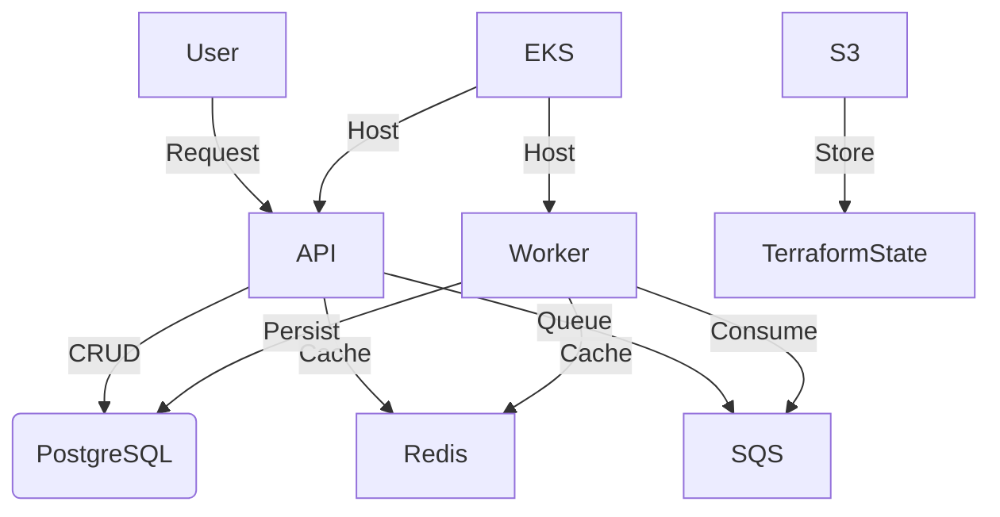

<p align="center">

</p>

# Desafio Técnico Backend: Solução Completa com Arquitetura Hexagonal, Celery, Redis, AWS e Terraform

## Índice
1. [Introdução](#1-introdução)
2. [Visão Geral da Solução](#2-visão-geral-da-solução)
3. [Estrutura do Projeto: API e Infraestrutura](#3-estrutura-do-projeto-api-e-infraestrutura)
   - 3.1 [Arquitetura Hexagonal](#31-arquitetura-hexagonal)
   - 3.2 [Estrutura do Projeto API](#32-estrutura-do-projeto-api)
   - 3.3 [Estrutura do Projeto Infra](#33-estrutura-do-projeto-infra)
4. [Execução Local: Docker Compose](#4-execução-local-docker-compose)
5. [Fluxo de Salvar Contato e Outros CRUDs](#5-fluxo-de-salvar-contato-e-outros-cruds)
   - 5.1 [Diagrama de Sequência para Criar Contato](#51-diagrama-de-sequência-para-criar-contato)
   - 5.2 [Fluxo de Leitura, Atualização e Exclusão](#52-fluxo-de-leitura-atualização-e-exclusão)
6. [Celery: Funcionamento e Cuidados](#6-celery-funcionamento-e-cuidados)
7. [Testes Unitários e Integrados](#7-testes-unitários-e-integrados)
8. [Infraestrutura AWS com Terraform](#8-infraestrutura-aws-com-terraform)
9. [Diagramas da Arquitetura](#9-diagramas-da-arquitetura)
   - 9.1 [Diagrama da Infraestrutura com Mermaid](#91-diagrama-da-infraestrutura-com-mermaid)
10. [Conclusão](#10-conclusão)

---

## 1. Introdução

Este guia é uma solução detalhada para o desafio técnico de backend, onde você deve criar uma API para gerenciar contatos (CRUD), utilizando uma **arquitetura hexagonal** e separando claramente a lógica de domínio das implementações de infraestrutura. A aplicação também será dividida em dois projetos: **API** e **Infraestrutura**, cada um com seus próprios processos de **CI/CD** e ferramentas de automação.

A principal responsabilidade deste projeto é garantir que a aplicação seja escalável, performática, e siga boas práticas de design de software. Também será discutido como o **Celery** será utilizado para orquestrar eventos, gerenciando o fluxo de contatos de forma assíncrona.

---

## 2. Visão Geral da Solução

### Arquitetura Hexagonal
A **arquitetura hexagonal** é uma abordagem para construir software onde a lógica de negócios (Domínio) fica desacoplada dos frameworks e serviços externos, permitindo flexibilidade e testabilidade. A lógica de negócios não depende diretamente de como os dados são salvos ou recuperados. Ela apenas define regras e comandos, enquanto a infraestrutura lida com as implementações reais.

A arquitetura está dividida em três camadas:
1. **Camada de Domínio**: Contém as regras de negócio e os serviços principais do sistema.
2. **Camada de Aplicação**: Exposição de APIs REST, mapeamento de URLs, e orquestração de chamadas à camada de domínio.
3. **Camada de Infraestrutura**: Contém a implementação de persistência no banco de dados, cache (Redis), e filas de mensagens (AWS SQS).

### Funcionamento do Celery
O **Celery** é responsável por processar tarefas em segundo plano. No contexto deste projeto, ele será usado para orquestrar o fluxo de contatos, gerenciando a criação de novos contatos por meio de eventos que são processados de forma assíncrona.

---

## 3. Estrutura do Projeto: API e Infraestrutura

### 3.1 Estrutura do Projeto API

O projeto **API** contém toda a lógica de negócios e a infraestrutura necessária para a aplicação funcionar. A divisão clara das camadas facilita a manutenção e o entendimento da arquitetura.

```bash
api/
│
├── contacts/                    
│   ├── adapters/                # Infraestrutura (banco, cache, filas)
│   │   ├── repositories/        # Implementação de persistência (PostgreSQL)
│   │   ├── cache/               # Implementação do cache (Redis)
│   │   ├── queue/               # Implementação das filas (AWS SQS)
│   │   └── serializers.py       # Serializadores para JSON
│   │
│   ├── domain/                  # Lógica de negócios (Domínio)
│   │   ├── models.py            # Modelos de domínio (Contato)
│   │   └── services.py          # Lógica de negócios (Cadastrar, editar, excluir contatos)
│   │
│   ├── application/             # Camada de aplicação (APIs)
│   │   ├── views.py             # Controladores HTTP
│   │   ├── urls.py              # Rotas da aplicação
│   │   └── commands.py          # Comandos CQRS (escrita)
│   │
│   └── tests/                   # Testes automatizados
│       ├── unit/                # Testes unitários
│       ├── integration/         # Testes de integração (com banco e Redis)
│       └── sqs_tests.py         # Testes de integração com AWS SQS
│
├── manage.py                    # Script para gerenciar o projeto Django
├── requirements.txt             # Dependências do projeto (Django, Celery, boto3, etc.)
├── Dockerfile                   # Definição do container Docker
└── docker-compose.yml            # Docker Compose para orquestrar os serviços localmente
```

### 3.2 Estrutura do Projeto Infra

O projeto **Infraestrutura** é responsável por provisionar a infraestrutura do sistema utilizando **Terraform** para orquestrar os serviços na AWS.

```bash
infra/
├── envs/
│   ├── dev/                     # Configuração para ambiente de desenvolvimento
│   └── prod/                    # Configuração para ambiente de produção
└── modules/
    ├── eks/                     # Provisionamento do EKS (Kubernetes)
    ├── rds/                     # Provisionamento do RDS (PostgreSQL)
    ├── redis/                   # Provisionamento do Redis (ElastiCache)
    └── sqs/                     # Configuração das filas SQS
```

Cada módulo no diretório `modules/` é responsável por gerenciar um componente específico da infraestrutura. Esses módulos são reutilizáveis para diferentes ambientes.

---

## 4. Execução Local: Docker Compose

A aplicação pode ser executada localmente utilizando **Docker Compose** para orquestrar os serviços necessários, como o banco de dados PostgreSQL, o Redis e o Celery.

### 4.1 Como Subir a Aplicação Localmente

1. **Clone o repositório da API**:
   ```bash
   git clone https://github.com/seuprojeto/api.git
   cd api/
   ```

2. **Suba o Ambiente com Docker Compose**:
   ```bash
   docker-compose up --build
   ```

3. **Acesse a API**:
   Acesse `http://localhost:8000` para interagir com a API.

4. **Executar Testes**:
   Para rodar os testes automatizados:
   ```bash
   docker-compose exec web python manage.py test
   ```

### 4.2 Processos de CI/CD da API e Infraestrutura

- **API Projeto**: Utiliza **GitHub Actions** para rodar os testes unitários e integrados, e depois faz o deploy na infraestrutura **EKS**.
- **Infra Projeto**: Utiliza **Terraform** para gerenciar o provisionamento e monitoramento da infraestrutura AWS.

---

## 5. Fluxo de Salvar Contato e Outros CRUDs

### 5.1 Diagrama de Sequência para Criar Contato

A seguir, veremos como funciona o fluxo de criação de um contato, detalhando o funcionamento entre a camada de aplicação, domínio, e infraestrutura.

```mermaid
sequenceDiagram
    participant User
    participant API
    participant Domain
    participant Redis
    participant SQS
    participant Celery
    participant DB

    User->>+API: Enviar requisição POST para criar contato
    API->>+Domain: Criar contato no domínio
    Domain->>+SQS: Enviar evento para SQS (contato a ser criado)
    SQS->>+Celery: Celery consome mensagem de criação de contato
    Celery->>+DB: Persistir contato no PostgreSQL
    DB-->>-Celery: Contato salvo com sucesso
    Celery-->>-Redis: Cachear novo contato
    Redis-->>-Domain: Cache atualizado
    API-->>-User: Retornar sucesso
```

#### Explicação do Fluxo
1. O usuário faz uma requisição **POST** para criar um contato.
2. A camada de **domínio**

 processa a lógica e valida as informações.
3. Um evento é enviado para a fila **SQS** para ser processado de forma assíncrona pelo **Celery**.
4. O **Celery** consome a mensagem da fila, salva o contato no **PostgreSQL** e atualiza o **Redis** com o cache do novo contato.

### 5.2 Fluxo de Leitura, Atualização e Exclusão

Os fluxos de **leitura**, **atualização** e **exclusão** seguem uma estrutura similar. No caso de leitura, a API primeiro verifica o **Redis** (cache) e, caso os dados não estejam no cache, consulta o banco de dados **PostgreSQL**.

---

## 6. Celery: Funcionamento e Cuidados

O **Celery** é uma ferramenta fundamental neste projeto para lidar com o processamento de grandes volumes de dados de forma assíncrona. No contexto da API de contatos, ele processa eventos enviados pela API para o **AWS SQS** e lida com a criação de contatos de forma desacoplada.

### Cuidados ao Usar Celery
- **Gerenciamento de Falhas**: Caso uma tarefa falhe, ela precisa ser reprocessada de maneira segura.
- **Timeouts**: Definir um limite de tempo adequado para evitar que tarefas presas sobrecarreguem o sistema.
- **Escalabilidade**: O Celery deve ser configurado com múltiplos workers para garantir que o sistema consiga lidar com o grande volume de requisições simultâneas.

---

## 7. Testes Unitários e Integrados

### 7.1 Estrutura dos Testes Unitários

Os **testes unitários** garantem que cada parte isolada da aplicação funcione corretamente, sem envolver serviços externos. Por exemplo, o **serviço de domínio** que cria um contato pode ser testado sem interagir com o banco de dados.

Exemplo de teste unitário para o serviço de criação de contato:

```python
from django.test import TestCase
from contacts.domain.services import ContactService

class ContactServiceTest(TestCase):

    def test_create_contact(self):
        service = ContactService()
        contact = service.create_contact({
            'first_name': 'John',
            'last_name': 'Doe',
            'email': 'john@example.com',
            'phone': '123456789'
        })
        self.assertEqual(contact.first_name, 'John')
```

### 7.2 Estrutura dos Testes Integrados

Os **testes integrados** verificam se todos os componentes da aplicação funcionam juntos como esperado. Esses testes envolvem o banco de dados, cache e filas.

Exemplo de teste de integração com a fila SQS:

```python
from django.test import TestCase
from unittest.mock import patch
from contacts.application.views import ContactViewSet

class ContactIntegrationTest(TestCase):

    @patch('contacts.adapters.queue.send_contact_event_to_sqs')
    def test_create_contact_integration(self, mock_send_sqs):
        response = self.client.post('/contacts/', {
            'first_name': 'Jane',
            'last_name': 'Doe',
            'email': 'jane@example.com',
            'phone': '987654321'
        })
        self.assertEqual(response.status_code, 201)
        mock_send_sqs.assert_called_once()
```

---

## 8. Infraestrutura AWS com Terraform

### 8.1 Visão Geral dos Componentes

A infraestrutura é composta por:
- **EKS**: Para rodar a API.
- **RDS (PostgreSQL)**: Banco de dados relacional.
- **Redis (ElastiCache)**: Cache.
- **SQS**: Fila para orquestração de eventos.

### 8.2 Provisionamento com Terraform

Utilizamos **Terraform** para provisionar os recursos na AWS:

```hcl
module "eks" {
  source = "../modules/eks"
  environment = "dev"
}

module "rds" {
  source = "../modules/rds"
  environment = "dev"
}

module "redis" {
  source = "../modules/redis"
  environment = "dev"
}

module "sqs" {
  source = "../modules/sqs"
  environment = "dev"
}
```

---

## 9. Diagramas da Arquitetura

### 9.1 Diagrama da Infraestrutura com Mermaid

O diagrama a seguir descreve como a infraestrutura da aplicação é organizada:



---

## 10. Conclusão

Esta solução detalha a implementação de uma API escalável e performática para gerenciamento de contatos. O uso de uma **arquitetura hexagonal** garante que a lógica de negócios esteja desacoplada dos detalhes de infraestrutura, como **Redis**, **PostgreSQL** e **SQS**. O **Celery** orquestra o processamento assíncrono, enquanto o **Terraform** gerencia a infraestrutura na **AWS**, garantindo alta disponibilidade e escalabilidade.

